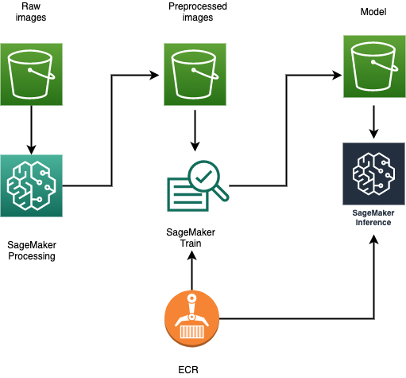

# Distributed training of digital pathology tissue slide images using SageMaker and Horovod

In this tutorial, using detection of cancer from tissue slide images as an example, we will explain how to build a highly scalable machine learning pipeline to
* Pre-process Gigapixel images by tiling, zooming, and sorting them into train and test splits using Amazon SageMaker Processing.
* Train an image classifier on pre-processed tiled images using Amazon SageMaker, Horovod and SageMaker Pipe mode.
* Deploy a pre-trained model as an API using Amazon SageMaker.

## Data
In this blog, we will be using a dataset consisting of whole-slide images obtained from The Cancer Genome Atlas (TCGA) to accurately and automatically classify them into LUAD (Adenocarcinoma), LUSC (squamous cell carcinoma), or normal lung tissue, where LUAD and LUSC are the two most prevalent subtypes of lung cancer. The dataset is available for public use by NIH and NCI. Instructions for downloading data are provided here. The raw high resolution images are in SVS format. SVS files are used for archiving and analyzing Aperio microscope images..The techniques and tools used in this blog can be applied to any Gigapixel image data set such as satellite images.

Instructions to download TCGA dataset
* *Download and Install gdc client:* It is a command-line interface supporting data downloads from TCGA. Follow the [instructions](https://gdc.cancer.gov/access-data/gdc-data-transfer-tool) to download a binary distribution. 
* *Initiate data download:* Run the following command to initiate the download process.

  `gdc-client download -m gdc_manifest_20170302_003611.txt`

## Architecture Overview
The following figure shows the overall end-to-end architecture, from the original raw images to inference. First, we use SageMaker Processing to tile, zoom, and sort the images into train and test splits, and then package them into the necessary number of shards for distributed SageMaker training. Second, a SageMaker training job loads the Docker container from ECR (Elastic Container Registry) and uses Pipe Mode to read the data from the prepared shards of images, trains the model, and stores the final model artifact in S3. Finally, we deploy the trained model on a real-time inference endpoint that loads the appropriate Docker container (from ECR) and model (from S3) to process inference requests with low latency.

# References
1. Nicolas Coudray, Paolo Santiago Ocampo, Theodore Sakellaropoulos, Navneet Narula, Matija Snuderl, David Fenyö, Andre L. Moreira, Narges Razavian, Aristotelis Tsirigos. "Classification and mutation prediction from non–small cell lung cancer histopathology images using deep learning". Nature Medicine, 2018; DOI: 10.1038/s41591-018-0177-5
1. https://github.com/ncoudray/DeepPATH/tree/master/DeepPATH_code
1. https://www.cancer.gov/about-nci/organization/ccg/research/structural-genomics/tcga
1. https://sagemaker.readthedocs.io/en/stable/amazon_sagemaker_processing.html
1. https://aws.amazon.com/getting-started/hands-on/build-train-deploy-machine-learning-model-sagemaker/

# Security

See [CONTRIBUTING](CONTRIBUTING.md#security-issue-notifications) for more information.

# License

This library is licensed under the MIT-0 License. See the LICENSE file.

